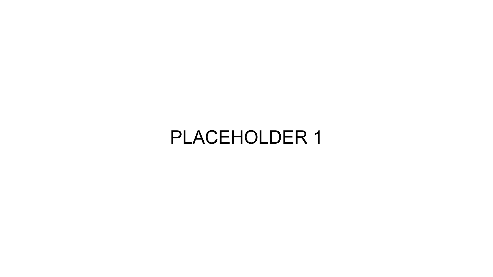
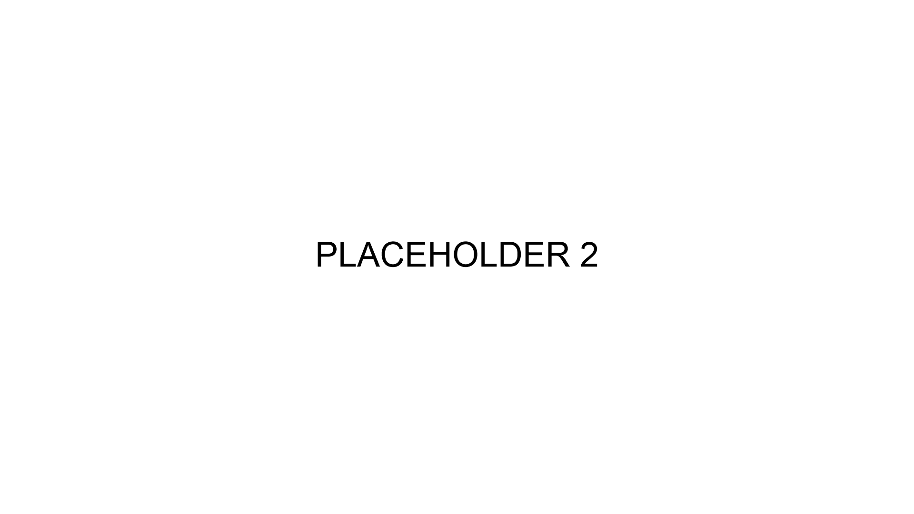
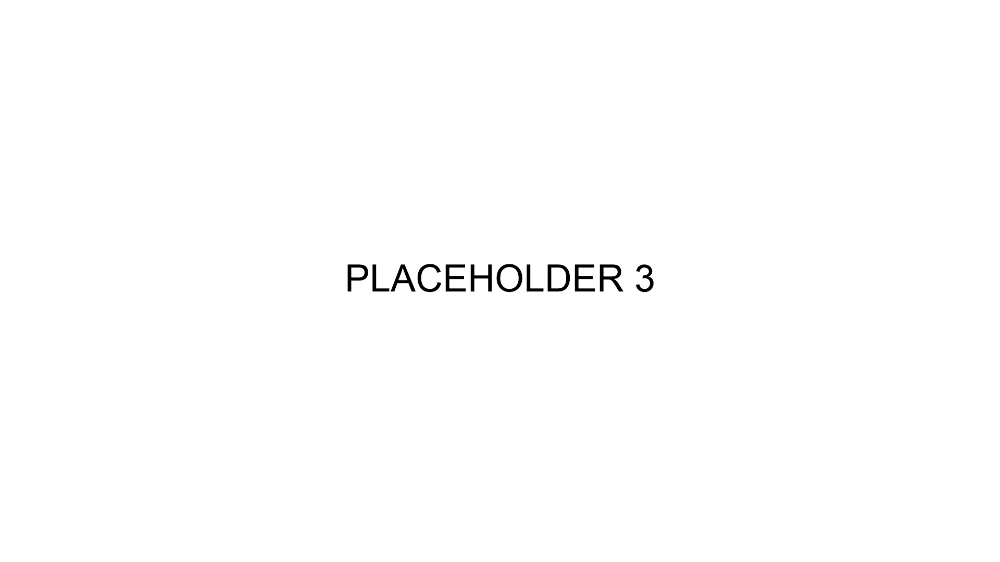

  
  <h1>QOLLOCK</h1>
  

    A customizable HUD and quality-of-life mod for Deadlock. Adjust the interface to
    your preferences, keep useful information in view, and save or share your setup.
  

  

    
    
    
    
    
  

## Features

- **Customize your HUD:** move, resize and recolor supported HUD elements, with
  controls for visibility and opacity.
- **Choose your healthbar:** multiple styles, including Minecraft, Minimalist
  and FG variants, plus configurable health colors and warnings.
- **Keep track of timers:** objective timers, bridge-buff reminders, reload
  countdowns and item cooldown displays.
- **Adjust your minimap:** layout controls, objective overlays, crates and
  tunnel overlays.
- **Improve your shop view:** purchase notifications, recent purchases,
  additional stats and quickbuy options.
- **Keep your configuration:** save, load, export and import settings, or start
  from a preset.

## Getting Started

### Download

Get packaged builds from [GitHub Releases](https://github.com/civo7/QOLLOCK/releases)
or the [GameBanana page](https://gamebanana.com/mods/650634).
Release archives use names such as `QOL-Lock-405.zip` and contain the compiled VPK.
Follow the instructions supplied with the build or on its download page.

GitHub's automatically generated **Source code** archives contain development
sources, not the ready-to-use mod. This repository is the source project.

Deadlock updates can change the native UI used by the mod. Check
[release notes](https://github.com/civo7/QOLLOCK/releases) and
[GameBanana updates](https://gamebanana.com/mods/updates/650634) for fixes.

## Usage

### Settings

QOLLOCK includes its own settings interface with previews and a Customize editor
for supported HUD elements. Individual features can be configured to suit your
setup.

## Contributing

See [CONTRIBUTING.md](CONTRIBUTING.md) for development and offline checks,
[ARCHITECTURE.md](ARCHITECTURE.md) for the technical map, and
[translation instructions](translations/README.md) to help with languages.

## License

Original QOLLOCK contributions are licensed under [Apache-2.0](LICENSE).
See [NOTICE](NOTICE) and [third-party notices](THIRD_PARTY_NOTICES.md) for attribution
and materials that are not covered by this license. Deadlock and its original
game resources belong to Valve. Minecraft fonts belong to Mojang.

## Report a Problem

Open an [issue](https://github.com/civo7/QOLLOCK/issues) with the mod version,
steps to reproduce, relevant settings and a screenshot when the problem is visual.
Include your resolution and any other HUD mods you use.

## Credits

QOLLOCK combines work by its maintainers and the wider Deadlock modding community.

| Maintainer | Contributions |
| --- | --- |
| [civo](https://gamebanana.com/members/5146349), [BreadRollius](https://gamebanana.com/members/4296197) | Maintenance and many contributions |
| [bytenode](https://gamebanana.com/members/5222690) | Maintenance, Minecraft/Minimalist HP Bar, item buy notifications and more |
| [Predi_i](https://gamebanana.com/members/5107678) | Maintenance, Bridge Buff Reminder, top-bar nicknames, old ability progress bars, active stats, saving and loading |

| Contributor | Contributions |
| --- | --- |
| [bonclide](https://gamebanana.com/members/2408486) | Top Bar Plus |
| [gyzeh](https://gamebanana.com/members/4868100) | 4:3 support |
| [RizoBoy](https://gamebanana.com/members/4436032) | Library |
| [Goblin Man Sam](https://gamebanana.com/members/4762321) | Shop stats |
| [Hanturaya](https://gamebanana.com/members/4577138) | Friends' ranks, stats and account IDs; Mid Boss/Bridge Buff Timer; passive/active icons; Red Diamond |
| [Fascilux](https://gamebanana.com/members/4690723) | Keyboard Overlay |
| [mikoboy](https://gamebanana.com/members/2814130) | Legacy Ammo Crosshair |
| [wouwei](https://gamebanana.com/members/4788864) | Remove Cumulative Damage |
| [ninjabladeJr](https://gamebanana.com/members/4779465) | Many contributions |
| [flameblast12](https://gamebanana.com/members/4789815) | Dota Style Icons |
| [ArkanoidVFX](https://gamebanana.com/members/1359230) | Damage Fountain |
| [somarotsaway](https://gamebanana.com/members/3961199), [Emily Vasquez](https://gamebanana.com/members/1383839) | FG Healthbar |
| [Klutzz](https://gamebanana.com/members/4745216) | Klutzz's Healthbar |
| [gfkm](https://gamebanana.com/members/5349748) | Crate Overlay |
| [Aminsx](https://gamebanana.com/members/4798159) | Enhanced Quickbuy |
| [oGeorge](https://gamebanana.com/members/5260464) | Deadlock for Dummies, Rem Tunnels Overlay |
| [lustie_](https://gamebanana.com/members/4872008) | Clean Damage Indicators |
| [0xluc4s](https://gamebanana.com/members/5229080) | Show Build ID |
| [BubbleGumXD](https://gamebanana.com/members/5281881) | Save/load system contributions |

| Announcer contributor | Contributions |
| --- | --- |
| [The_MoDifier_DL](https://gamebanana.com/members/4795931) | Hero Announcer Project |
| [BreGraham](https://gamebanana.com/members/5273754) | Graves |
| [Josefumi](https://gamebanana.com/members/2252478) | Viscous, Seven |
| Viewtiful Valentine | Drifter |
| ZMPixie | Rem |
