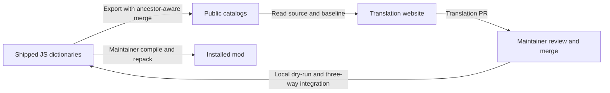

# Translation workflow repair — 2026-10-07

The starting audit was found in `codex/customize-hud`, at
`docs/REPOSITORY_AUDIT_2026_10.md` (retrieve with `git show`).
Its translation findings were reproduced on the current branch.

## Confirmed remote state

Public catalog PRs [#63 (Turkish)](https://github.com/Predi-i/QOLLOCK-translations/pull/63)
and [#62 (Simplified Chinese)](https://github.com/Predi-i/QOLLOCK-translations/pull/62)
were reviewed for file scope, source-key agreement, JSON types and markup, then
merged. The integrated public revision is recorded in
`translations/import-baseline.json`. No mod or website branch was pushed.

The mod's [export run](https://github.com/civo7/QOLLOCK/actions/runs/37612233417)
completed successfully and exported the main source inventory. This did not
integrate public translations into the mod.

The website's [context run](https://github.com/Predi-i/qollock-translate/actions/runs/37611509911)
also reported success, but extracted zero entries. Its remote context artifact was
empty. Local fixes restore context from current settings owners, reject empty or
malformed output, and require a reviewed override for large source removals.

## Repaired boundaries

JSON/CSV imports now preflight complete inputs and proposed JS, skip retired
keys, preserve blank cells and meaningful whitespace, report conflicts, and fail
without partial changes. BAT export no longer calls import or performs a hidden
pull. Repeat integration is idempotent.

Community Chinese, Turkish and Korean updates were imported without replacing
local corrections. English/Russian source omissions and Dev/Config statuses were
localized. Display text retains accents and punctuation. Other languages keep
explicit English fallback for remaining untranslated source keys; coverage is
not a claim of translation quality.

The website also shares one protected-placeholder implementation between its
client and server. Both `{name}` and `{{name}}` retain their original syntax.
Tests cover flat punctuation keys, context failure preservation, open-PR branch
reuse and draft materialization.

## Publication and native verification still belong to the maintainer

These repairs are local. Publish the QOLLOCK exporter before the website consumer
so its hosted updater can find the new source contract. Local commits do not
repair the already deployed website or trigger catalog export.

Use [Localization](LOCALIZATION.md) for the routine commands. Run `npm test`
in QOLLOCK and `pnpm test` / `pnpm typecheck` on the website. Then the maintainer
compiles/repacks and verifies language switching, dynamic Dev/Config messages,
arcade results and Unicode glyphs in the client. No game build, repack, deployment
or new runtime language registration was performed.
